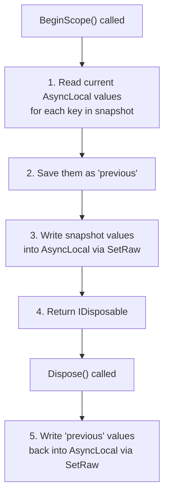
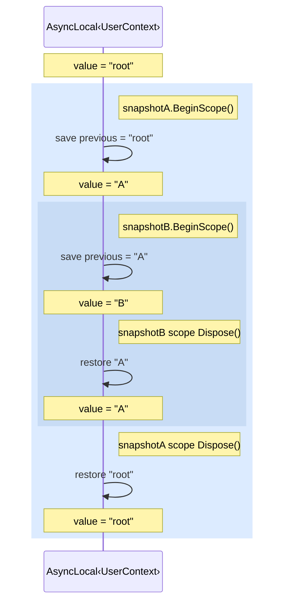
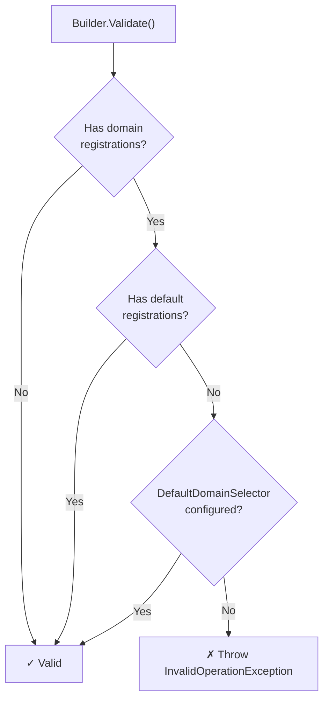
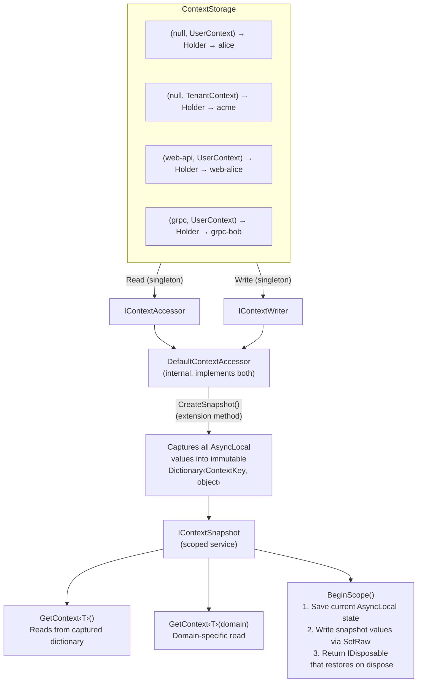
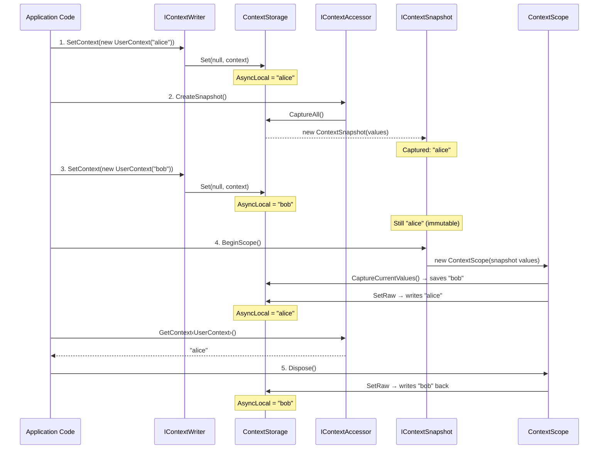
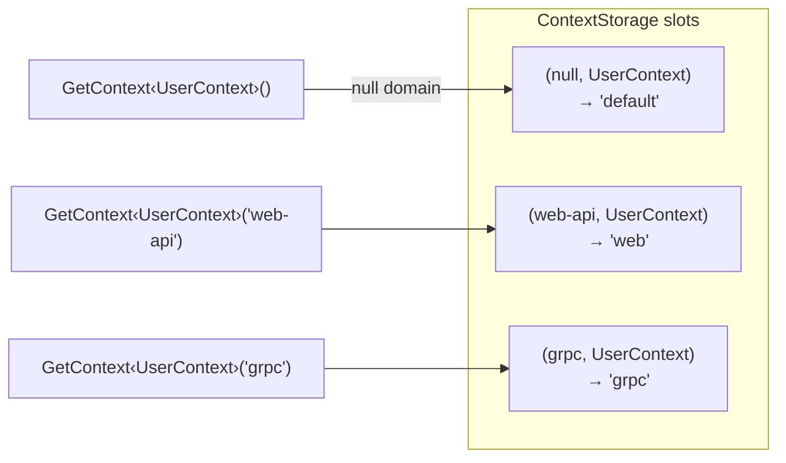
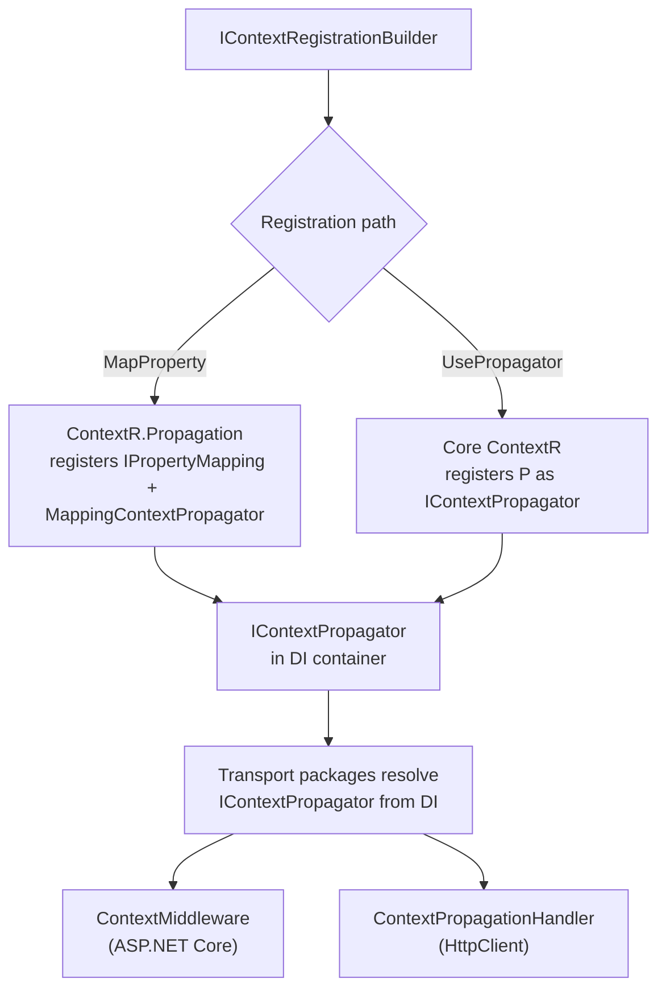
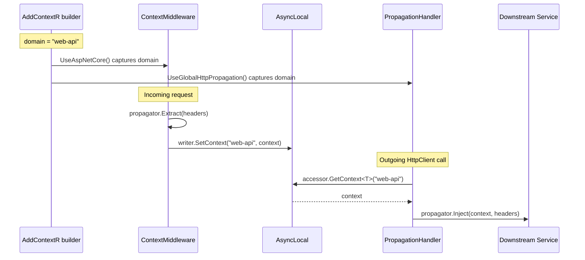

# ContextR -- Architecture and Design Decisions

This document explains the internal architecture of ContextR, the reasoning behind design choices, and answers common questions about `AsyncLocal`, snapshots, domains, and context propagation.

## Table of contents

- [How context is stored](#how-context-is-stored)
- [The problem: context loss](#the-problem-context-loss)
- [The snapshot solution](#the-snapshot-solution)
- [How BeginScope works internally](#how-beginscope-works-internally)
- [Set vs SetRaw -- a critical distinction](#set-vs-setraw----a-critical-distinction)
- [Domain-scoped context](#domain-scoped-context)
- [DI registration design](#di-registration-design)
- [Component overview](#component-overview)
- [Propagator architecture](#propagator-architecture)
- [File map](#file-map)
- [FAQ](#faq)

---

## How context is stored

At the core of ContextR is `ContextStorage`, which holds:

```
ConcurrentDictionary<ContextKey, AsyncLocal<ContextHolder?>>
```

The `ContextKey` is a composite key:

```csharp
internal readonly record struct ContextKey(string? Domain, Type ContextType);
```

This means each combination of domain + context type gets its own independent `AsyncLocal` slot. A `null` domain represents the default (domainless) slot.

The `ContextHolder` is a simple wrapper:

```csharp
internal sealed class ContextHolder
{
    public object? Context;
}
```

**Why a holder instead of storing the object directly?**

The holder introduces an indirection layer. When the regular `Set<T>()` method clears context, it sets `holder.Context = null` on the *existing* holder rather than replacing the `AsyncLocal` value. Because all `ExecutionContext` copies share the same holder reference, this clears the context in all of them simultaneously. This is intentional for the normal lifecycle -- when context is cleared, no dangling references should see stale values.

**Bank account analogy:** The `ContextStorage` is the bank's ledger. Each `AsyncLocal` slot is a separate account. The `ContextKey` is the account number (combining the domain name with the type of currency). The `ContextHolder` is the safe deposit box -- multiple people (execution contexts) can hold a reference to the same box, so if the bank empties it, everyone sees it empty.

---

## The problem: context loss

`AsyncLocal<T>` flows with .NET's `ExecutionContext`. The runtime captures `ExecutionContext` at `await` points and restores it when the continuation runs. This works well within a single async flow.

Context loss happens in several scenarios:

### 1. `Task.Run` and fire-and-forget

```csharp
_writer.SetContext(new UserContext("alice"));

_ = Task.Run(() =>
{
    // Gets a COPY of ExecutionContext at the time Task.Run was called.
    // If the parent clears the holder before this task reads it,
    // the task sees null.
    var user = _accessor.GetContext<UserContext>(); // may be null!
});

// Parent clears context -- holder.Context is set to null.
// The child task's copy points to the SAME holder.
_writer.SetContext<UserContext>(null);
```

When `Task.Run` is called, the runtime captures a copy of the current `ExecutionContext`. The child task's copy points to the *same* `ContextHolder` instance. When the parent calls `SetContext<T>(null)`, it sets `holder.Context = null` on that shared instance. The child task now sees `null`.

### 2. ThreadPool and new threads

`ThreadPool.QueueUserWorkItem` and `new Thread()` do not reliably capture `ExecutionContext`. Context is simply not available.

### 3. Why not just use scoped services?

A common suggestion: "Why not store context in a scoped dictionary?"

This fails at DI scope boundaries. `HttpClientFactory`, for example, creates a separate DI scope for each `DelegatingHandler` pipeline. A scoped service in the handler would be a fresh, empty instance -- not the one populated by the caller.

`AsyncLocal` does not have this problem. It is ambient -- any code on the same `ExecutionContext` can read it regardless of DI scope. That is why `IContextAccessor` and `IContextWriter` are registered as **singletons**.

---

## The snapshot solution

The snapshot mechanism captures all context values at a point in time into an immutable object. This solves context loss across `Task.Run`, background jobs, batch processing, and any scenario where `AsyncLocal` flow is unreliable.

### `IContextSnapshot`

```csharp
public interface IContextSnapshot
{
    TContext? GetContext<TContext>() where TContext : class;
    TContext? GetContext<TContext>(string domain) where TContext : class;
    IDisposable BeginScope();
}
```

- `GetContext<T>()` -- reads from the captured values dictionary (no `AsyncLocal`).
- `GetContext<T>(domain)` -- reads a domain-specific captured value.
- `BeginScope()` -- writes captured values into `AsyncLocal` and returns a disposable that restores previous state.

### Creating snapshots

**Method 1: From current ambient state**

```csharp
var snapshot = _accessor.CreateSnapshot();
```

Iterates all `AsyncLocal` slots, copies non-null values into an immutable dictionary.

**Method 2: From a specific value (zero side effects)**

```csharp
var snapshot = _accessor.CreateSnapshot(new UserContext("bob"));
var snapshot = _accessor.CreateSnapshot("web-api", new UserContext("bob"));
```

Builds the snapshot directly from the provided object. Does NOT read from or write to `AsyncLocal`. This is the preferred approach for batch processing.

### Why this design?

**Zero overhead for non-snapshot use.** If you never create snapshots, no extra work happens. Context is stored and read from `AsyncLocal` as normal.

**Backward compatible.** Existing code using `IContextAccessor` continues to work. The accessor reads from `AsyncLocal`, which `BeginScope()` populates.

**Two clear interfaces, two clear roles:**
- `IContextSnapshot` (scoped) -- **recommended for most code.** Immutable, safe across async boundaries. The **bank statement**.
- `IContextAccessor` (singleton) -- for infrastructure that must read live `AsyncLocal` state. The **live bank balance**.

---

## How BeginScope works internally

`BeginScope()` creates a `ContextScope`:



The key property: **only the current `ExecutionContext` is affected.** If you call `BeginScope()` inside `Task.Run`, the parent's `AsyncLocal` values are not modified. This is because `SetRaw` replaces the `AsyncLocal.Value` (which is per-`ExecutionContext`) rather than mutating a shared holder.

### Nesting

Scopes are nestable. Each scope saves and restores only the keys it touches:



### Double-dispose safety

`ContextScope` tracks a `_disposed` flag. Calling `Dispose()` multiple times is safe -- only the first call restores state.

---

## Set vs SetRaw -- a critical distinction

The `ContextStorage` has two write methods with fundamentally different behaviors:

### `Set<T>()` -- used by normal context writes

```csharp
public void Set<T>(string? domain, T? context) where T : class
{
    var slot = GetSlot(key);
    var holder = slot.Value;
    if (holder is not null)
        holder.Context = null;      // Mutates the shared holder

    if (context is not null)
        slot.Value = new ContextHolder { Context = context };  // New holder
}
```

When clearing context (`context = null`), this sets `holder.Context = null` on the existing holder. Because all `ExecutionContext` copies share the same holder reference, this clears context *everywhere*. This is the correct behavior for normal lifecycle -- when context is cleared, no stale references should remain.

**Bank analogy:** Closing an account. Everyone holding a reference to that account's safe deposit box now finds it empty.

### `SetRaw()` -- used by snapshot BeginScope / Dispose

```csharp
public void SetRaw(ContextKey key, object? context)
{
    var slot = GetSlot(key);
    slot.Value = context is null ? null : new ContextHolder { Context = context };
}
```

This **replaces** the `AsyncLocal.Value` entirely instead of mutating an existing holder. Because `AsyncLocal` is copy-on-write per `ExecutionContext`, this only affects the current `ExecutionContext`. The parent flow's context is untouched.

**Bank analogy:** Opening a temporary account that only you can see. The original shared account is unaffected.

### Why this matters

If `BeginScope()` used `Set<T>()` instead of `SetRaw()`, disposing the scope would clear the holder's `Context` field, which would null out the context in the *parent* flow too. With `SetRaw()`, the dispose only replaces the `AsyncLocal.Value` in the current `ExecutionContext`, leaving the parent's value intact.

This is the single most important implementation detail in the snapshot system.

---

## Domain-scoped context

Domains allow different parts of an application to maintain **isolated context values** for the same type. The key insight: a `ContextKey` is a composite of `(string? Domain, Type ContextType)`, so `("web-api", typeof(UserContext))` and `("grpc", typeof(UserContext))` are completely independent storage slots.

**Bank analogy:** Domains are like different accounts at the same bank -- checking, savings, investment. Each has its own balance, its own statement, its own transactions. Parameterless `GetContext<UserContext>()` reads from your "primary" account (the default domain or the one selected by `DefaultDomainSelector`).

### ContextKey

```csharp
internal readonly record struct ContextKey(string? Domain, Type ContextType);
```

The `null` domain represents the default (domainless) slot. When no `DefaultDomainSelector` is configured, parameterless `GetContext<T>()` reads from `ContextKey(null, typeof(T))`.

### DefaultDomainSelector

```csharp
public sealed class ContextDomainPolicy
{
    public Func<IServiceProvider, string?>? DefaultDomainSelector { get; set; }
}
```

When configured, parameterless calls to `GetContext<T>()` and `SetContext<T>()` delegate to the domain returned by this selector. The selector receives `IServiceProvider`, allowing dynamic resolution at application startup.

**Bank analogy:** The `DefaultDomainSelector` is like setting your "default account" at the bank. When you say "check my balance" without specifying an account, the bank shows you the default one.

### Builder validation

ContextR validates domain configuration at startup:



This prevents a runtime trap: if you register `AddDomain("web-api", ...)` but forget to either add a default `Add<T>()` or configure `AddDomainPolicy(...)`, then parameterless `GetContext<T>()` would silently read from an unregistered null-domain slot. The validation catches this at configuration time.

### How domains interact with snapshots

`CreateSnapshot()` captures **all** slots across all domains. The snapshot's parameterless `GetContext<T>()` uses the `DefaultDomain` that was resolved when the `DefaultContextAccessor` was constructed, ensuring consistent behavior between the accessor and its snapshots.

---

## DI registration design

### Core registrations (`AddContextR`)

```csharp
services.TryAddSingleton(builder.DomainPolicy);           // ContextDomainPolicy
services.TryAddSingleton<DefaultContextAccessor>();        // Internal: combined read/write
services.TryAddSingleton<IContextAccessor>(sp => ...);     // Forwards to DefaultContextAccessor
services.TryAddSingleton<IContextWriter>(sp => ...);       // Forwards to DefaultContextAccessor
services.TryAddScoped<IContextSnapshot>(sp =>              // Captures at resolution time
{
    var accessor = sp.GetRequiredService<DefaultContextAccessor>();
    return new ContextSnapshot(
        DefaultContextAccessor.CaptureCurrentValues(),
        accessor.DefaultDomain);
});
```

### Why singleton for accessor/writer?

Because `AsyncLocal` is ambient state -- it does not care about DI scopes. A singleton that reads from `AsyncLocal` works correctly everywhere, including inside `HttpClientFactory` handler pipelines that create their own DI scopes.

### Why scoped for snapshot?

The snapshot is captured at DI scope creation time. Within an HTTP request (one scope per request), this means the snapshot reflects the ambient state at the start of the request and never changes -- exactly like a bank statement issued at a specific moment.

### Why `TryAdd`?

`TryAddSingleton` and `TryAddScoped` are idempotent. If `AddContextR` is called multiple times (e.g., by multiple library initializers), only the first registration wins. This prevents duplicate services.

### Interface lifetime summary

| Interface | Lifetime | Who should use it |
|---|---|---|
| `IContextSnapshot` | Scoped | **Recommended for most code.** Immutable, safe across async boundaries. |
| `IContextAccessor` | Singleton | Infrastructure code that must read live `AsyncLocal` state. |
| `IContextWriter` | Singleton | Code that needs to set initial context values. |

---

## Component overview



### Snapshot flow



### Domain isolation flow



**Without `DefaultDomainSelector`:**

| Call | Resolves to slot | Returns |
|---|---|---|
| `GetContext<UserContext>()` | `(null, UserContext)` | `"default"` |
| `GetContext<UserContext>("web-api")` | `("web-api", UserContext)` | `"web"` |
| `GetContext<UserContext>("grpc")` | `("grpc", UserContext)` | `"grpc"` |

**With `DefaultDomainSelector = _ => "web-api"`:**

| Call | Resolves to slot | Returns |
|---|---|---|
| `GetContext<UserContext>()` | `("web-api", UserContext)` | `"web"` (delegated) |
| `GetContext<UserContext>("web-api")` | `("web-api", UserContext)` | `"web"` |
| `GetContext<UserContext>("grpc")` | `("grpc", UserContext)` | `"grpc"` |

---

## Propagator architecture

The `IContextPropagator<TContext>` interface is the bridge between ContextR's ambient storage and transport layers (HTTP, gRPC, Kafka, etc.). It lives in the core `ContextR` package because all transport packages depend on it.

### Carrier pattern

The propagator uses a generic carrier pattern inspired by OpenTelemetry's `TextMapPropagator`. Instead of depending on specific transport types (`HttpRequestHeaders`, `Metadata`), the propagator operates on abstract getter/setter delegates:

```csharp
public interface IContextPropagator<TContext> where TContext : class
{
    void Inject<TCarrier>(TContext context, TCarrier carrier, Action<TCarrier, string, string> setter);
    TContext? Extract<TCarrier>(TCarrier carrier, Func<TCarrier, string, string?> getter);
}
```

This means one propagator implementation works with any carrier type. The transport package provides the concrete carrier and delegate:

```
HTTP injection:  propagator.Inject(context, request.Headers, (h, k, v) => h.TryAddWithoutValidation(k, v))
HTTP extraction: propagator.Extract(httpContext.Request.Headers, (h, k) => h.TryGetValue(k, out var v) ? v : null)
gRPC injection:  propagator.Inject(context, metadata, (m, k, v) => m.Add(k, v))
```

### Registration model

Propagators are registered in DI as singletons. There are two registration paths:



Both paths use `TryAdd`, so the first registration wins. This makes `MapProperty` and `UsePropagator` mutually exclusive for a given context type.

### Domain-aware transport flow

When context is registered within a domain, transport extensions capture the domain string at configuration time. The domain flows through the system:



---

## File map

### ContextR (core)

#### Public API

| File | Role |
|------|------|
| `IContextAccessor.cs` | Read interface: `GetContext<T>()`, `GetContext<T>(domain)` |
| `IContextWriter.cs` | Write interface: `SetContext<T>()`, `SetContext<T>(domain, context)` |
| `IContextSnapshot.cs` | Snapshot interface: `GetContext<T>()`, `GetContext<T>(domain)`, `BeginScope()` |
| `IContextPropagator.cs` | Transport-agnostic serialization/deserialization interface using carrier pattern |
| `IContextBuilder.cs` | Builder interface: `Add<T>()`, `AddDomain()`, `AddDomainPolicy()` |
| `IDomainContextBuilder.cs` | Domain builder interface: `Add<T>()` |
| `IContextRegistrationBuilder<T>.cs` | Per-type configuration surface with `UsePropagator<T>()` and extensibility for transport packages |
| `ContextDomainPolicy.cs` | Policy class with `DefaultDomainSelector` property |

#### Extensions

| File | Role |
|------|------|
| `ContextRServiceCollectionExtensions.cs` | `AddContextR()` -- DI registration entry point |
| `ContextSnapshotExtensions.cs` | `CreateSnapshot()` overloads on `IContextAccessor` |
| `ContextRequiredExtensions.cs` | `GetRequiredContext<T>()` overloads on accessor and snapshot |

#### Internal

| File | Role |
|------|------|
| `DefaultContextAccessor.cs` | Singleton implementing `IContextAccessor` + `IContextWriter`. Delegates to `ContextStorage`. Resolves `DefaultDomain` from policy. |
| `ContextStorage.cs` | `ConcurrentDictionary<ContextKey, AsyncLocal<ContextHolder?>>`. Core storage with `Get`, `Set`, `SetRaw`, `CaptureAll`. |
| `ContextSnapshot.cs` | Immutable `IContextSnapshot` implementation. Defensive-copies values at construction time. |
| `ContextScope.cs` | `IDisposable` created by `BeginScope()`. Saves previous `AsyncLocal` state, applies snapshot, restores on dispose. |
| `ContextKey.cs` | `readonly record struct (string? Domain, Type ContextType)`. Composite key for storage. |
| `ContextHolder.cs` | Wrapper class with `object? Context` field. Enables shared-reference clearing by `Set`. |
| `ContextBuilder.cs` | Internal `IContextBuilder` implementation. Tracks registrations and validates configuration. |
| `DomainContextBuilder.cs` | Internal `IDomainContextBuilder` implementation. |
| `ContextRegistrationBuilder<T>.cs` | Internal `IContextRegistrationBuilder<T>` implementation. Exposes `Services` and `Domain` for transport extensions. |

### ContextR.Propagation

| File | Role |
|------|------|
| `ContextRPropagationExtensions.cs` | `MapProperty()` extension method. Registers `IPropertyMapping<T>` and `MappingContextPropagator<T>` into DI. |
| `Internal/IPropertyMapping.cs` | Internal interface: `Key`, `GetValue`, `TrySetValue` |
| `Internal/PropertyMapping.cs` | Expression-compiled property accessor. Handles `string`, `IParsable<T>`, and `Convert.ChangeType` parsing. |
| `Internal/MappingContextPropagator.cs` | `IContextPropagator<T>` that delegates `Inject`/`Extract` to collected `IPropertyMapping<T>` instances. |

### ContextR.Http

| File | Role |
|------|------|
| `ContextPropagationHandler.cs` | `DelegatingHandler` that reads context from `IContextAccessor` and injects headers via `IContextPropagator<T>`. Domain-aware. |
| `Extensions/ContextRHttpRegistrationExtensions.cs` | `UseGlobalHttpPropagation()` -- registers handler via `ConfigureHttpClientDefaults`. Captures domain. |
| `Extensions/ContextRHttpClientBuilderExtensions.cs` | `AddContextRHandler<T>()` -- per-client handler registration on `IHttpClientBuilder`. |

### ContextR.AspNetCore

| File | Role |
|------|------|
| `Internal/ContextMiddleware.cs` | Extracts context from `HttpContext.Request.Headers` via `IContextPropagator<T>.Extract`. Writes to `IContextWriter`. Domain-aware. |
| `Internal/ContextStartupFilter.cs` | `IStartupFilter` that inserts `ContextMiddleware<T>` at the start of the pipeline. Passes domain to middleware. |
| `Extensions/ContextRAspNetCoreRegistrationExtensions.cs` | `UseAspNetCore()` -- registers `ContextStartupFilter<T>` with captured domain. |

---

## FAQ

### Q: Why is `IContextAccessor` a singleton and not scoped?

Because it must be readable from DI scopes that are different from the caller's scope. The most common case is `HttpClientFactory`, which creates a new scope for each handler pipeline. If the accessor were scoped, handlers would get a fresh, empty instance.

`AsyncLocal` is ambient state -- it does not care about DI scopes. A singleton that reads from `AsyncLocal` works correctly everywhere.

### Q: Why not just replace `IContextAccessor` with `IContextSnapshot`? It's safer.

They serve different roles.

`IContextAccessor` is a singleton that reads **live** from `AsyncLocal`. Every call returns whatever is in `AsyncLocal` *right now*. That value can change -- `SetContext()` writes to it, `BeginScope()` temporarily overrides it. Think of it as your **live bank balance** -- always reflecting the latest transaction.

`IContextSnapshot` captures context **once** into an immutable object. After that, it never changes. Think of it as a **bank statement** -- showing the balance at a specific moment.

`BeginScope()` bridges them: it writes the statement's values *into* the live balance, so infrastructure reading the live balance picks them up. If infrastructure used the snapshot directly, it wouldn't know *which* snapshot to use -- there could be many active concurrently.

### Q: Is the snapshot safe if someone adds a `SetContext()` call downstream?

Yes. `BeginScope()` uses `SetRaw()` which replaces `AsyncLocal.Value` per-`ExecutionContext` (copy-on-write). If downstream code calls `SetContext()` inside a scope, the mutation is isolated. The parent flow's context is not affected because `Dispose()` restores using `SetRaw()`.

### Q: Is `CaptureAll()` / `CreateSnapshot()` safe under parallel calls?

Yes. `CaptureAll()` iterates `ConcurrentDictionary` (lock-free enumeration) and reads `AsyncLocal.Value` for each entry (per-`ExecutionContext` read). Two threads calling `CreateSnapshot()` simultaneously read from their own independent slots. They cannot interfere with each other.

### Q: Can I nest multiple `BeginScope()` calls?

Yes. Each scope saves and restores only the context keys it touches. Scopes are stacked correctly:

```csharp
using (snapshotA.BeginScope())
{
    // Context = A's values
    using (snapshotB.BeginScope())
    {
        // Context = B's values
    }
    // Context = A's values (restored)
}
// Context = original values (restored)
```

### Q: What happens if I forget to dispose the scope?

The snapshot values will remain active in the current `AsyncLocal` for the lifetime of the `ExecutionContext`. This is similar to forgetting to dispose an `ILogger.BeginScope()` -- it won't crash, but context won't be cleaned up. Always use `using`.

### Q: What is the performance cost of snapshots?

`CreateSnapshot()` iterates the `ConcurrentDictionary` and copies key-value pairs into a new `Dictionary<ContextKey, object>`. For a typical application with 1-3 context types and 1-2 domains, this is a handful of dictionary operations. The snapshot object itself is a small allocation.

`BeginScope()` does the same amount of work: one dictionary read (to save previous state) and one `AsyncLocal.Value` assignment per context key.

In practice, this cost is negligible compared to the I/O operations that typically follow.

### Q: What is the difference between `ContextKey(null, typeof(T))` and `ContextKey("web-api", typeof(T))`?

They are completely independent storage slots. Setting a value in one has no effect on the other. The `null` domain is the default slot used by parameterless `GetContext<T>()` when no `DefaultDomainSelector` is configured.

### Q: Why does the builder validate domain registrations?

Without validation, this configuration would silently break:

```csharp
builder.AddDomain("web-api", d => d.Add<UserContext>());
// No builder.Add<UserContext>() and no DefaultDomainSelector
```

Parameterless `GetContext<UserContext>()` would read from `ContextKey(null, typeof(UserContext))`, which was never registered. Instead of returning mysterious `null` at runtime, the builder throws at startup with a clear message explaining the required fix.

### Q: Do I need locks or synchronization when using snapshots?

No. The storage is a `ConcurrentDictionary`, and `AsyncLocal` operations are inherently thread-safe (each thread/`ExecutionContext` has its own slot). Concurrent tasks creating, activating, and disposing snapshots do not interfere with each other.

### Q: Is there a risk of context leaking between requests?

No. `AsyncLocal` is scoped to the `ExecutionContext`, which is unique per async flow. Two concurrent requests have independent `ExecutionContext` instances and cannot see each other's values.

`BeginScope()` adds an extra layer of safety: it saves the previous `AsyncLocal` state and restores it on dispose.

### Q: Why does `Set<T>()` clear the holder but `SetRaw()` replaces the value?

This is the most important design decision in the system.

`Set<T>()` is called during normal context lifecycle. It sets `holder.Context = null` on the shared holder. Every `ExecutionContext` copy points to the same holder, so the clear propagates everywhere. This prevents stale context from leaking into tasks that outlive the caller.

`SetRaw()` is called by `BeginScope()` and its dispose. It replaces the `AsyncLocal.Value` with a new holder. Because `AsyncLocal` is copy-on-write per `ExecutionContext`, this only affects the current flow. The parent flow is preserved.

If `SetRaw()` used the same mutation approach as `Set<T>()`, disposing a child scope would accidentally null out the parent's context.

### Q: How does `DefaultDomainSelector` interact with `IServiceProvider`?

The selector is a `Func<IServiceProvider, string?>`. It is invoked once during `DefaultContextAccessor` construction (which happens at first resolution from the DI container, since it's a singleton). The returned domain string is stored as `DefaultDomain` and used for all subsequent parameterless calls.

This means the default domain is fixed for the lifetime of the application. If you need truly dynamic per-request domain routing, use the explicit `GetContext<T>(domain)` overload and resolve the domain name yourself.

### Q: Can different teams define their own context types?

Yes. The framework is fully generic. Any `class` can be a context type. Register multiple types and they coexist independently:

```csharp
builder.Services.AddContextR(ctx =>
{
    ctx.Add<UserContext>();
    ctx.Add<TenantContext>();
    ctx.Add<CorrelationContext>();
});
```

Each type gets its own `AsyncLocal` slot and is included in snapshots automatically.

### Q: Why is `IContextPropagator<T>` in the core package and not in `ContextR.Propagation`?

Because every transport package (`ContextR.Http`, `ContextR.AspNetCore`, future `ContextR.Grpc`) depends on this interface to serialize and deserialize context. Placing it in the core package means transport packages only need a dependency on `ContextR`, not on `ContextR.Propagation`.

`ContextR.Propagation` provides one *implementation strategy* (`MapProperty` → `MappingContextPropagator`). Users who implement `IContextPropagator<T>` directly and register it with `UsePropagator<T>()` never need the `ContextR.Propagation` package at all.

### Q: Why does `UseGlobalHttpPropagation()` use `ConfigureHttpClientDefaults`?

`ConfigureHttpClientDefaults` is the .NET 8+ API for applying configuration to all `HttpClient` instances created by `IHttpClientFactory`. It is the cleanest way to add a `DelegatingHandler` globally without requiring each client to be individually configured.

This means all named clients, typed clients, and default clients automatically get context propagation. For selective propagation, use `AddContextRHandler<T>()` on specific `IHttpClientBuilder` instances instead.

### Q: Why is `ContextPropagationHandler<T>` registered as scoped?

`DelegatingHandler` instances are not thread-safe. `IHttpClientFactory` creates a new handler pipeline per logical client scope, and each pipeline needs its own handler instance. Scoped registration ensures each handler gets its own instance within the factory's scope.

### Q: Why does the ASP.NET Core middleware use `IStartupFilter` instead of requiring `app.UseMiddleware()`?

Two reasons. First, `IStartupFilter` ensures the middleware runs before all user-configured middleware, so context is available everywhere. Second, it removes the need for an explicit call in `Program.cs` -- the middleware is registered automatically as part of `AddContextR`.

### Q: Can I use `MapProperty` and `UseAspNetCore` without `UseGlobalHttpPropagation`?

Yes. Each extension is independent. You can extract context from incoming requests without propagating it to outgoing calls, or vice versa. The extensions compose freely:

```csharp
// Extract only (no outgoing propagation)
ctx.Add<CorrelationContext>(reg => reg
    .MapProperty(c => c.TraceId, "X-Trace-Id")
    .UseAspNetCore());

// Propagate only (no incoming extraction)
ctx.Add<CorrelationContext>(reg => reg
    .MapProperty(c => c.TraceId, "X-Trace-Id")
    .UseGlobalHttpPropagation());

// Both
ctx.Add<CorrelationContext>(reg => reg
    .MapProperty(c => c.TraceId, "X-Trace-Id")
    .UseAspNetCore()
    .UseGlobalHttpPropagation());
```

### Q: What happens if context is set but no propagator is registered?

Transport packages resolve `IContextPropagator<T>` from DI. If no propagator is registered, DI resolution will fail with an `InvalidOperationException` at the first request. This is intentional -- it surfaces configuration errors early rather than silently skipping propagation.
