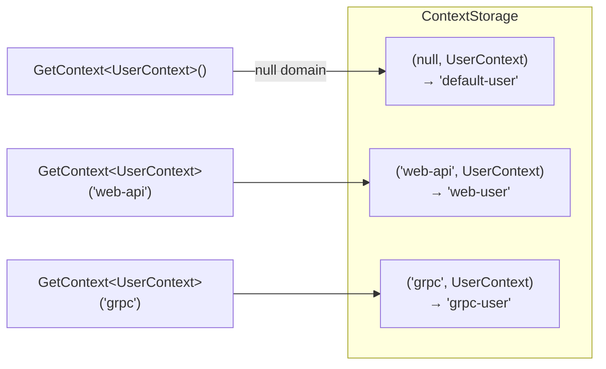
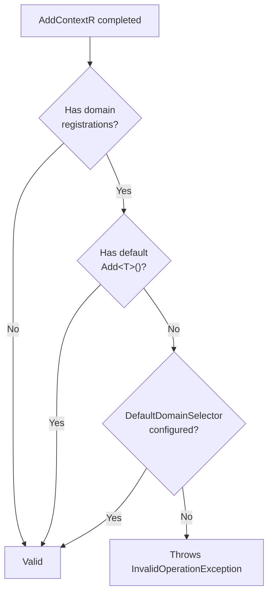

# Domain Configuration

Domains let different parts of your application maintain **isolated context values** for the same type. A single `UserContext` class can hold separate values for your web API layer, gRPC layer, and background jobs -- all without interference.

This guide covers everything you need to configure single-domain and multi-domain setups.

## Table of contents

- [When to use domains](#when-to-use-domains)
- [How it works](#how-it-works)
- [Single-domain setup](#single-domain-setup)
- [Multi-domain setup](#multi-domain-setup)
- [Default domain selector](#default-domain-selector)
- [Domains with transport packages](#domains-with-transport-packages)
- [Domains with snapshots](#domains-with-snapshots)
- [Validation rules](#validation-rules)
- [Reading and writing domain context](#reading-and-writing-domain-context)
- [Complete examples](#complete-examples)
- [Decision matrix](#decision-matrix)

---

## When to use domains

Use domains when:

- The same context type must carry **different values** for different transport channels (HTTP vs gRPC)
- A gateway fans out to multiple downstream services and each channel needs its own context
- You want per-domain failure handling or propagation strategy policies
- Different parts of the application resolve the same context type from different header sets

If you have a single transport and a single context value per type, you do not need domains. The default (domainless) registration is simpler and sufficient.

---

## How it works

Internally, ContextR stores context in a dictionary keyed by `(Domain, ContextType)`:

```
(null,      typeof(UserContext))  →  default slot
("web-api", typeof(UserContext))  →  web-api slot
("grpc",    typeof(UserContext))  →  grpc slot
```

Each slot is an independent `AsyncLocal` -- writing to one never affects another.



---

## Single-domain setup

Register a domain alongside a default (domainless) registration:

```csharp
builder.Services.AddContextR(ctx =>
{
    // Default registration -- handles parameterless GetContext<T>() / SetContext<T>()
    ctx.Add<UserContext>(reg => reg
        .MapProperty(c => c.TenantId, "X-Tenant-Id")
        .MapProperty(c => c.UserId, "X-User-Id")
        .UseAspNetCore()
        .UseGlobalHttpPropagation());

    // Domain registration -- isolated slot for "web-api"
    ctx.AddDomain("web-api", domain =>
    {
        domain.Add<UserContext>(reg => reg
            .MapProperty(c => c.TenantId, "X-WebApi-Tenant-Id")
            .MapProperty(c => c.UserId, "X-WebApi-User-Id")
            .UseAspNetCore()
            .UseGlobalHttpPropagation());
    });
});
```

The default registration ensures that parameterless calls like `GetContext<UserContext>()` work without requiring a `DefaultDomainSelector`.

---

## Multi-domain setup

Add as many domains as you need. Each domain is a separate call to `AddDomain`:

```csharp
builder.Services.AddContextR(ctx =>
{
    // Default (domainless) registration
    ctx.Add<UserContext>(reg => reg
        .MapProperty(c => c.TenantId, "X-Tenant-Id")
        .UseAspNetCore()
        .UseGlobalHttpPropagation());

    // Web API domain
    ctx.AddDomain("web-api", domain =>
    {
        domain.Add<UserContext>(reg => reg
            .MapProperty(c => c.TenantId, "X-WebApi-Tenant-Id")
            .MapProperty(c => c.UserId, "X-WebApi-User-Id")
            .UseAspNetCore()
            .UseGlobalHttpPropagation());
    });

    // gRPC domain
    ctx.AddDomain("grpc", domain =>
    {
        domain.Add<UserContext>(reg => reg
            .MapProperty(c => c.TenantId, "grpc-tenant-id")
            .MapProperty(c => c.UserId, "grpc-user-id")
            .UseGlobalGrpcPropagation());
    });

    // Background jobs domain
    ctx.AddDomain("jobs", domain =>
    {
        domain.Add<UserContext>();
    });
});
```

Each domain can have its own:
- Property mappings (different header names)
- Transport extensions (HTTP, gRPC, or none)
- Failure handling policies
- Oversize strategy policies

### Multiple context types per domain

A domain can register multiple context types:

```csharp
ctx.AddDomain("web-api", domain =>
{
    domain
        .Add<UserContext>(reg => reg
            .MapProperty(c => c.UserId, "X-User-Id")
            .UseAspNetCore()
            .UseGlobalHttpPropagation())
        .Add<TenantContext>(reg => reg
            .MapProperty(c => c.TenantId, "X-Tenant-Id")
            .UseAspNetCore()
            .UseGlobalHttpPropagation());
});
```

---

## Default domain selector

When you use **only** domain registrations (no root-level `Add<T>()`), parameterless calls like `GetContext<UserContext>()` need to know which domain to read from. Configure a `DefaultDomainSelector`:

### Option A: static selector

```csharp
builder.Services.AddContextR(ctx =>
{
    ctx.AddDomain("web-api", domain =>
    {
        domain.Add<UserContext>(reg => reg
            .MapProperty(c => c.UserId, "X-User-Id")
            .UseAspNetCore()
            .UseGlobalHttpPropagation());
    });

    ctx.AddDomain("grpc", domain =>
    {
        domain.Add<UserContext>(reg => reg
            .MapProperty(c => c.UserId, "grpc-user-id")
            .UseGlobalGrpcPropagation());
    });

    // Parameterless GetContext<UserContext>() reads from "web-api"
    ctx.AddDomainPolicy(p => p.DefaultDomainSelector = _ => "web-api");
});
```

### Option B: resolve from DI

```csharp
builder.Services.AddContextR(ctx =>
{
    ctx.AddDomain("web-api", domain => domain.Add<UserContext>());
    ctx.AddDomain("grpc", domain => domain.Add<UserContext>());

    // Resolve default domain from application configuration
    ctx.AddDomainPolicy(sp =>
    {
        var config = sp.GetRequiredService<IConfiguration>();
        return config["ContextR:DefaultDomain"];
    });
});
```

### Option C: shorthand selector

```csharp
ctx.AddDomainPolicy(sp => sp.GetRequiredService<IMyDomainResolver>().GetDefault());
```

**How it works at runtime:** The selector runs **once** when `DefaultContextAccessor` is first resolved from DI (singleton lifetime). The returned domain string is cached for the application lifetime. For per-request domain routing, use the explicit `GetContext<T>(domain)` overload instead.

---

## Domains with transport packages

Transport extensions capture the domain at registration time. The domain flows through the entire pipeline automatically.

### ASP.NET Core (incoming requests)

```csharp
ctx.AddDomain("web-api", domain =>
{
    domain.Add<UserContext>(reg => reg
        .MapProperty(c => c.TenantId, "X-Tenant-Id")
        .UseAspNetCore());     // Middleware writes to "web-api" domain
});
```

When a request arrives, `ContextMiddleware<UserContext>` extracts headers and writes the result to the `"web-api"` domain slot via `writer.SetContext("web-api", context)`.

### HTTP client (outgoing requests)

```csharp
ctx.AddDomain("web-api", domain =>
{
    domain.Add<UserContext>(reg => reg
        .MapProperty(c => c.TenantId, "X-Tenant-Id")
        .UseGlobalHttpPropagation());   // Handler reads from "web-api" domain
});
```

When an `HttpClient` call is made, `ContextPropagationHandler<UserContext>` reads from `accessor.GetContext<UserContext>("web-api")` and injects the mapped headers.

### gRPC (bidirectional)

```csharp
ctx.AddDomain("grpc", domain =>
{
    domain.Add<UserContext>(reg => reg
        .MapProperty(c => c.TenantId, "grpc-tenant-id")
        .UseGlobalGrpcPropagation());   // Interceptors use "grpc" domain
});
```

### Combining transports across domains

A common pattern: extract from HTTP, propagate to both HTTP and gRPC:

```csharp
builder.Services.AddContextR(ctx =>
{
    // Web API: extract from incoming HTTP, propagate to outgoing HTTP
    ctx.AddDomain("web-api", domain =>
    {
        domain.Add<UserContext>(reg => reg
            .MapProperty(c => c.TenantId, "X-Tenant-Id")
            .MapProperty(c => c.UserId, "X-User-Id")
            .UseAspNetCore()
            .UseGlobalHttpPropagation());
    });

    // gRPC: propagate to downstream gRPC services
    ctx.AddDomain("grpc", domain =>
    {
        domain.Add<UserContext>(reg => reg
            .MapProperty(c => c.TenantId, "grpc-tenant-id")
            .MapProperty(c => c.UserId, "grpc-user-id")
            .UseGlobalGrpcPropagation());
    });

    ctx.AddDomainPolicy(p => p.DefaultDomainSelector = _ => "web-api");
});
```

---

## Domains with snapshots

Snapshots capture **all domain slots** at the point of creation.

### Capture all domains

```csharp
writer.SetContext(new UserContext { UserId = "default-user" });
writer.SetContext("web-api", new UserContext { UserId = "web-user" });
writer.SetContext("grpc", new UserContext { UserId = "grpc-user" });

var snapshot = accessor.CaptureSnapshot();

// Snapshot contains all three values
snapshot.GetContext<UserContext>();               // "default-user"
snapshot.GetContext<UserContext>("web-api");       // "web-user"
snapshot.GetContext<UserContext>("grpc");           // "grpc-user"
```

### Create a domain-specific snapshot

```csharp
var snapshot = accessor.CreateSnapshot("web-api", new UserContext { UserId = "scoped" });

snapshot.GetContext<UserContext>("web-api");   // "scoped"
snapshot.GetContext<UserContext>();             // null (only "web-api" was captured)
```

### BeginScope with domains

`BeginScope()` restores **all** captured domain values into `AsyncLocal`:

```csharp
writer.SetContext("web-api", new UserContext { UserId = "parent" });

var snapshot = accessor.CreateSnapshot("web-api", new UserContext { UserId = "child" });

using (snapshot.BeginScope())
{
    accessor.GetContext<UserContext>("web-api");   // "child"
}

accessor.GetContext<UserContext>("web-api");       // "parent" (restored)
```

### Background processing with domain context

```csharp
var snapshot = accessor.CaptureSnapshot();

_ = Task.Run(async () =>
{
    using (snapshot.BeginScope())
    {
        // All domain values are available here
        var user = accessor.GetContext<UserContext>("web-api");
        await processor.RunAsync(user);
    }
});
```

---

## Validation rules

ContextR validates domain configuration at startup to prevent silent runtime errors.

### Rule: domain-only registration requires a fallback

If you register **any** domain but do **not** register a default (domainless) `Add<T>()`, you must provide a `DefaultDomainSelector`. Otherwise, `AddContextR` throws:

```
InvalidOperationException:
Domain registrations were configured but no default (domainless) registration exists
and no DefaultDomainSelector was provided via AddDomainPolicy.
Either call Add<TContext>() at the root level to register a default,
or configure AddDomainPolicy(sp => ...) to select a default domain.
```

### Three valid patterns

**Pattern 1: Default + domains** (safest, always works)

```csharp
ctx.Add<UserContext>();                                          // default slot
ctx.AddDomain("web-api", d => d.Add<UserContext>());             // "web-api" slot
ctx.AddDomain("grpc", d => d.Add<UserContext>());                // "grpc" slot
```

**Pattern 2: Domains + selector** (no default slot, selector routes parameterless calls)

```csharp
ctx.AddDomain("web-api", d => d.Add<UserContext>());
ctx.AddDomain("grpc", d => d.Add<UserContext>());
ctx.AddDomainPolicy(p => p.DefaultDomainSelector = _ => "web-api");
```

**Pattern 3: No domains** (simplest, backward compatible)

```csharp
ctx.Add<UserContext>();
```

### Invalid pattern

```csharp
// INVALID -- throws at startup
ctx.AddDomain("web-api", d => d.Add<UserContext>());
// No Add<UserContext>() and no AddDomainPolicy(...)
```

### Validation flow



---

## Reading and writing domain context

### Writing

```csharp
var writer = sp.GetRequiredService<IContextWriter>();

// Write to default (domainless) slot
writer.SetContext(new UserContext { UserId = "alice" });

// Write to specific domain
writer.SetContext("web-api", new UserContext { UserId = "web-alice" });

// Clear a domain value
writer.SetContext<UserContext>("web-api", null);
```

### Reading

```csharp
var accessor = sp.GetRequiredService<IContextAccessor>();

// Read from default slot (or DefaultDomainSelector target)
var user = accessor.GetContext<UserContext>();

// Read from specific domain
var webUser = accessor.GetContext<UserContext>("web-api");

// Throw if missing
var required = accessor.GetRequiredContext<UserContext>("web-api");
```

### Reading from snapshots

```csharp
var snapshot = sp.GetRequiredService<IContextSnapshot>();

var user = snapshot.GetContext<UserContext>();
var webUser = snapshot.GetContext<UserContext>("web-api");
var required = snapshot.GetRequiredContext<UserContext>("web-api");
```

---

## Complete examples

### Example 1: Gateway with HTTP and gRPC downstream

A gateway receives HTTP requests and fans out to both HTTP and gRPC downstream services. Each channel carries the same `UserContext` but with different header conventions.

```csharp
public sealed class UserContext
{
    public string? TenantId { get; set; }
    public string? UserId { get; set; }
    public string? CorrelationId { get; set; }
}

builder.Services.AddContextR(ctx =>
{
    // Incoming HTTP: extract from request headers
    ctx.AddDomain("http", domain =>
    {
        domain.Add<UserContext>(reg => reg
            .MapProperty(c => c.TenantId, "X-Tenant-Id")
            .MapProperty(c => c.UserId, "X-User-Id")
            .MapProperty(c => c.CorrelationId, "X-Correlation-Id")
            .UseAspNetCore()
            .UseGlobalHttpPropagation());
    });

    // Downstream gRPC: propagate via metadata
    ctx.AddDomain("grpc", domain =>
    {
        domain.Add<UserContext>(reg => reg
            .MapProperty(c => c.TenantId, "grpc-tenant-id")
            .MapProperty(c => c.UserId, "grpc-user-id")
            .MapProperty(c => c.CorrelationId, "grpc-correlation-id")
            .UseGlobalGrpcPropagation());
    });

    // Parameterless calls resolve to "http"
    ctx.AddDomainPolicy(p => p.DefaultDomainSelector = _ => "http");
});
```

Application code:

```csharp
public class OrderController : ControllerBase
{
    private readonly IContextSnapshot _snapshot;
    private readonly OrderGrpcClient _grpcClient;
    private readonly IContextWriter _writer;

    public OrderController(
        IContextSnapshot snapshot,
        OrderGrpcClient grpcClient,
        IContextWriter writer)
    {
        _snapshot = snapshot;
        _grpcClient = grpcClient;
        _writer = writer;
    }

    [HttpPost]
    public async Task<IActionResult> CreateOrder(CreateOrderRequest request)
    {
        // Read from default domain (routed to "http" by selector)
        var user = _snapshot.GetContext<UserContext>();

        // Copy relevant values to gRPC domain for downstream propagation
        _writer.SetContext("grpc", new UserContext
        {
            TenantId = user?.TenantId,
            UserId = user?.UserId,
            CorrelationId = user?.CorrelationId
        });

        var result = await _grpcClient.CreateAsync(request);
        return Ok(result);
    }
}
```

### Example 2: Multi-tenant SaaS with per-domain failure policy

Different domains can have different failure handling:

```csharp
builder.Services.AddContextR(ctx =>
{
    // Internal API: strict -- throw on propagation failure
    ctx.AddDomain("internal-api", domain =>
    {
        domain.Add<UserContext>(reg => reg
            .MapProperty(c => c.TenantId, "X-Tenant-Id")
            .MapProperty(c => c.UserId, "X-User-Id")
            .OnPropagationFailure<UserContext>(_ => PropagationFailureAction.Throw)
            .UseAspNetCore()
            .UseGlobalHttpPropagation());
    });

    // Public API: lenient -- skip missing properties
    ctx.AddDomain("public-api", domain =>
    {
        domain.Add<UserContext>(reg => reg
            .MapProperty(c => c.TenantId, "X-Tenant-Id")
            .MapProperty(c => c.UserId, "X-User-Id")
            .OnPropagationFailure<UserContext>(_ => PropagationFailureAction.SkipProperty)
            .UseAspNetCore()
            .UseGlobalHttpPropagation());
    });

    ctx.AddDomainPolicy(p => p.DefaultDomainSelector = _ => "internal-api");
});
```

### Example 3: Domains with background job processing

```csharp
builder.Services.AddContextR(ctx =>
{
    ctx.Add<UserContext>();
    ctx.AddDomain("web-api", domain =>
    {
        domain.Add<UserContext>(reg => reg
            .MapProperty(c => c.TenantId, "X-Tenant-Id")
            .UseAspNetCore()
            .UseGlobalHttpPropagation());
    });
});

// In a controller or service:
public async Task EnqueueWork(IContextAccessor accessor)
{
    // Capture all domain values
    var snapshot = accessor.CaptureSnapshot();

    await _queue.EnqueueAsync(async () =>
    {
        using (snapshot.BeginScope())
        {
            // Both default and "web-api" domain values are restored
            var webUser = accessor.GetContext<UserContext>("web-api");
            await _processor.ProcessAsync(webUser);
        }
    });
}
```

---

## Decision matrix

| Scenario | Registration pattern | DefaultDomainSelector needed? |
|---|---|---|
| Single transport, one context per type | `Add<T>()` only | No |
| Single named domain + default fallback | `Add<T>()` + `AddDomain(...)` | No |
| Multiple named domains + default fallback | `Add<T>()` + multiple `AddDomain(...)` | No |
| Only named domains, no default slot | `AddDomain(...)` only | **Yes** |
| Dynamic default domain from config/DI | `AddDomain(...)` + `AddDomainPolicy(sp => ...)` | Yes (provided via selector) |

---

## API reference

### IContextBuilder

| Method | Description |
|---|---|
| `Add<T>(configure?)` | Registers a context type in the default (domainless) slot |
| `AddDomain(domain, configure)` | Registers context types within a named domain |
| `AddDomainPolicy(Action<ContextDomainPolicy>)` | Configures the domain policy object directly |
| `AddDomainPolicy(Func<IServiceProvider, string?>)` | Sets `DefaultDomainSelector` as a service-aware factory |

### IDomainContextBuilder

| Method | Description |
|---|---|
| `Add<T>(configure?)` | Registers a context type within this domain |

### ContextDomainPolicy

| Property | Type | Description |
|---|---|---|
| `DefaultDomainSelector` | `Func<IServiceProvider, string?>?` | Runs once at singleton resolution; returned domain is used for all parameterless calls |

### Domain-aware runtime APIs

| Interface | Method | Description |
|---|---|---|
| `IContextAccessor` | `GetContext(domain, Type)` | Reads from a specific domain slot |
| `IContextWriter` | `SetContext(domain, Type, object?)` | Writes to a specific domain slot |
| `IContextSnapshot` | `GetContext(domain, Type)` | Reads a domain value from the captured snapshot |
| `IContextAccessor` | `CreateSnapshot(domain, Type, object)` | Creates a snapshot for a single domain value |
