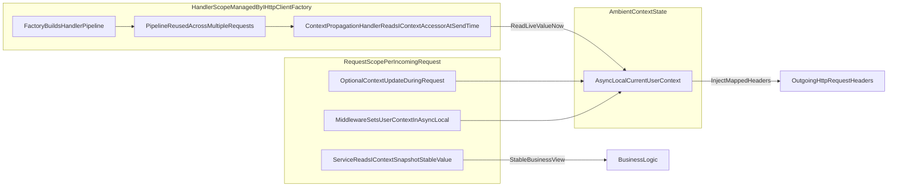

# HttpClient Handler Scopes and Context Propagation

This guide explains one of the most misunderstood .NET integration topics: `IHttpClientFactory` handler scopes, and why naive scoped-service propagation often fails in custom handlers.

## Why this document exists

Many engineers assume:

- controller/service uses scoped service `X`
- custom `DelegatingHandler` also injects scoped service `X`
- both are the same instance in one request

With `IHttpClientFactory`, that assumption is usually wrong.

## The scope mismatch problem

`HttpClient` message handlers are created as a handler pipeline managed by `IHttpClientFactory`.  
That handler scope is not the same as ASP.NET request scope. A handler may be reused across many requests for a period of time.

Consequences:

- constructor-injected scoped dependencies inside handlers can be effectively reused across requests
- handler-scoped dependencies may not match request-scoped dependencies
- stateful/scoped assumptions can produce subtle bugs (context leakage, stale values, unit-of-work mismatch)

## High-level flow diagram



Key takeaway:

- business code should read a stable snapshot
- propagation handlers must read the live ambient value at send time
- this separation avoids handler-scope/request-scope mismatch bugs

## Typical anti-pattern

```csharp
public sealed class MyContextHandler : DelegatingHandler
{
    private readonly UserContext _scopedContext;

    public MyContextHandler(UserContext scopedContext)
    {
        _scopedContext = scopedContext;
    }

    protected override Task<HttpResponseMessage> SendAsync(
        HttpRequestMessage request,
        CancellationToken cancellationToken)
    {
        request.Headers.TryAddWithoutValidation("X-User-Id", _scopedContext.UserId);
        return base.SendAsync(request, cancellationToken);
    }
}
```

This may seem correct, but it is not safe because handler and request scopes are different.

## ContextR solution model

ContextR avoids this pitfall by reading from ambient context at send time:

- `ContextPropagationHandler<TContext>` reads current context via `IContextAccessor` in `SendAsync`
- it injects mapped values through `IContextPropagator<TContext>`
- app code sets/updates ambient context through middleware/snapshots/writer

```csharp
protected override Task<HttpResponseMessage> SendAsync(
    HttpRequestMessage request,
    CancellationToken cancellationToken)
{
    var context = _accessor.GetContext<UserContext>();
    if (context is not null)
    {
        _propagator.Inject(context, request.Headers,
            static (headers, key, value) => headers.TryAddWithoutValidation(key, value));
    }

    return base.SendAsync(request, cancellationToken);
}
```

This design reads the effective value at execution time instead of capturing scoped state at handler-construction time.

## Correct registration patterns

### Global propagation

```csharp
builder.Services.AddContextR(ctx =>
{
    ctx.Add<UserContext>(reg => reg
        .MapProperty(c => c.TenantId, "X-Tenant-Id")
        .MapProperty(c => c.UserId, "X-User-Id")
        .MapProperty(c => c.TraceId, "X-Trace-Id")
        .UseAspNetCore()
        .UseGlobalHttpPropagation());
});
```

### Per-client propagation

```csharp
builder.Services.AddHttpClient("orders-api")
    .AddContextRHandler<UserContext>();
```

Use per-client mode when only selected downstream calls should receive context.

## If you still need custom handlers

If you must use a custom handler and need request-scoped services, do not assume constructor-injected scoped services are request-scoped. Either:

- resolve required data before sending and place it in ContextR ambient context, or
- explicitly bridge from current request context in a controlled way, with null-safe fallbacks for non-request execution

In most cases, a safer and cleaner approach is:

- keep custom handler stateless
- rely on ContextR mapping + propagation handler for contextual headers

## Real-world scenarios this fixes

- background operations that issue HTTP calls after request pipeline work
- parallel fan-out where each operation has distinct tenant/user context
- mixed middleware/service/handler stacks where request scope assumptions break
- retries and handler reuse windows causing stale scoped dependency behavior

## Testing checklist

- make two requests with different tenant/user values; verify outgoing headers do not leak between requests
- run parallel requests; verify isolation
- execute HTTP call from background task using snapshot scope; verify expected headers
- verify behavior when context is absent (no header injection, no exception unless required by policy)

## Related ContextR docs

- [ContextR.Transport.Http](ContextR.Http.md)
- [ContextR.Hosting.AspNetCore](ContextR.AspNetCore.md)
- [Getting Started](GettingStarted.md)
- [Usage Cookbook](UsageCookbook.md)

## External reference

Andrew Lock’s detailed explanation of handler/request scope behavior is a strong companion read:

- [DI scopes in IHttpClientFactory message handlers don't work like you think they do](https://andrewlock.net/understanding-scopes-with-ihttpclientfactory-message-handlers/)
